# Must do Pattern Problems before starting DSA

## src.Patterns: Learn Important Pattern Problems
|                         | S No. |           Pattern            |
|-------------------------|:-----:|:----------------------------:|
| <input type="checkbox"> |   1   | 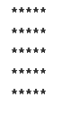)  |
| <input type="checkbox"> |   2   |  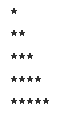  |
| <input type="checkbox"> |   3   |  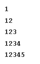  |
| <input type="checkbox"> |   4   |  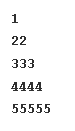  |
| <input type="checkbox"> |   5   |    |
| <input type="checkbox"> |   6   |  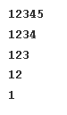  |
| <input type="checkbox"> |   7   |    |
| <input type="checkbox"> |   8   |  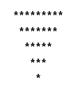  |
| <input type="checkbox"> |   9   |    |
| <input type="checkbox"> |  10   |  |
| <input type="checkbox"> |  11   | 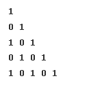 |
| <input type="checkbox"> |  12   | 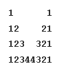 |
| <input type="checkbox"> |  13   | 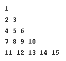 |
| <input type="checkbox"> |  14   | 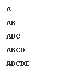 |
| <input type="checkbox"> |  15   | 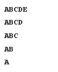 |
| <input type="checkbox"> |  16   | 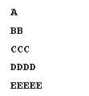 |
| <input type="checkbox"> |  17   | 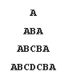 |
| <input type="checkbox"> |  18   | 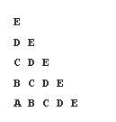 |
| <input type="checkbox"> |  19   | 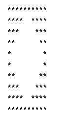 |
| <input type="checkbox"> |  20   | 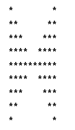 |
| <input type="checkbox"> |  21   |  |
| <input type="checkbox"> |  22   | 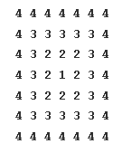 |